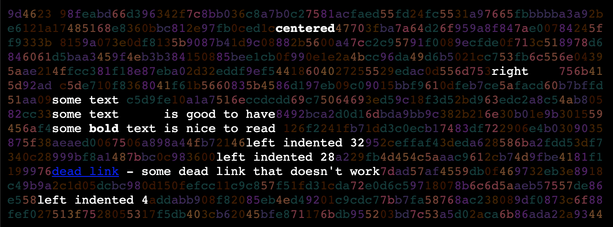

# deadbeef - fancypants webpage renderer

my 2006 php ascii art renderer...
[see here](../../deadbeef-js) for updated 2019 javascript version

## 0xdeadbeef</h1>
dead beef is a fancy ascii rendering utility.  it will place
random ascii characters in between the empty spaces of a paragraph of
text.

` "it's magic! and you'll wow your friends" - says your mom`




## example code
```
// php code
include( "deadbeef.php" );
 
$deadbeef_linkcolor = "#0090ff";
$deadbeef_alinkcolor = "#0090ff";
$deadbeef_vlinkcolor = "#0090ff";
$deadbeef_textcolor = "#ffffff";
$deadbeef_bgcolor = "#010101";
$deadbeef_tonemap = array( array(60,20,0), array(100,100,0),
array(150,0,150), array(20, 60, 60 ) );
$deadbeef_title = "subatomicglue - secret projects";
 
echo "&lt;table&gt;&lt;tr&gt;&lt;td&gt;"; 
$page_text = " 

&lt;c&gt;&lt;b&gt;centered&lt;/b&gt;&lt;/c&gt; 

&lt;r&gt;right    &lt;/r&gt; 
some text 
some text   is good to have
some text is nice to read 
&lt;l pos=32&gt;left indented 32&lt;/l&gt;
&lt;l pos=30&gt;left indented 30&lt;/l&gt;
&lt;a href="dead link"&gt;dead link&lt;/a&gt; - some dead link that doesn't work

&lt;l pos=4&gt;left indented 4&lt;/l&gt;

";
deadbeefDrawPage( $page_text, 6, 80, 13 );
```

<h2>License</h2>
<pre>   deadbeef - fancypants webpage renderer
   Copyright (c) 2006 kevin meinert all rights reserved

   This library is free software; you can redistribute it and/or
   modify it under the terms of the GNU Lesser General Public
   License as published by the Free Software Foundation; either
   version 2.1 of the License, or (at your option) any later version.

   This library is distributed in the hope that it will be useful,
   but WITHOUT ANY WARRANTY; without even the implied warranty of
   MERCHANTABILITY or FITNESS FOR A PARTICULAR PURPOSE.  See the GNU
   Lesser General Public License for more details.

   You should have received a copy of the GNU Lesser General Public
   License along with this library; if not, write to the Free Software
   Foundation, Inc., 51 Franklin Street, Fifth Floor, Boston, MA
   02110-1301  USA
   </pre>
</body></html>
